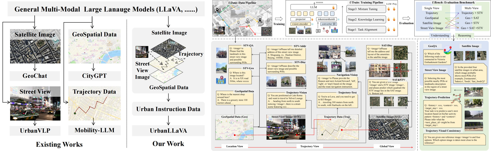

# UrbanLLaVA
This repo is for UrbanLLaVA: A Multi-modal Large Language Model for Urban Intelligence

## 📢 News
- 🎉: (2025.06) UrbanLLaVA has been accepted to **ICCV 2025**.

## Introduction
Urban research involves a wide range of scenarios and tasks that require the understanding of multi-modal data. Current methods often focus on specific data types and lack a unified framework in urban field for processing them comprehensively. The recent success of multi-modal large language models (MLLMs) presents a promising opportunity to overcome this limitation. In this paper, we introduce \textit{UrbanLLaVA}, a multi-modal large language model designed to process these four types of data simultaneously and achieve strong performance across diverse urban tasks compared with general MLLMs. In \textit{UrbanLLaVA}, we first curate a diverse urban instruction dataset encompassing both single-modal and cross-modal urban data, spanning from location view to global view of urban environment. Additionally, we propose a multi-stage training framework that decouples spatial reasoning enhancement from domain knowledge learning, thereby improving the compatibility and downstream performance of \textit{UrbanLLaVA} across diverse urban tasks. Finally, we also extend existing benchmark for urban research to assess the performance of MLLMs across a wide range of urban tasks. Experimental results from three cities demonstrate that \textit{UrbanLLaVA} outperforms open-source and proprietary MLLMs in both single-modal tasks and complex cross-modal tasks and shows robust generalization abilities across cities.

## 🌍 Framework

An overview of the motivation and framework of UrbanLLaVA is provided below.


## ⌨️ Codes Structure

**The code for our project is currently being prepared, and we plan to make it publicly available by mid-August.**


## 🌟 Citation

If you find this work helpful, please cite our paper.

```latex
@article{feng2025urbanllava,
  title={UrbanLLaVA: A Multi-modal Large Language Model for Urban Intelligence with Spatial Reasoning and Understanding},
  author={Feng, Jie and Wang, Shengyuan and Liu, Tianhui and Xi, Yanxin and Li, Yong},
  journal={arXiv preprint arXiv:2506.23219},
  year={2025}
}
```

## 👏 Acknowledgement

We appreciate the following GitHub repos a lot for their valuable code and efforts.

- https://github.com/NVlabs/VILA for MLLM training
- https://github.com/hiyouga/LLaMA-Factory for LLM training
- https://github.com/tsinghua-fib-lab/CityGPT for training and benchmark
- https://github.com/tsinghua-fib-lab/CityBench for benchmark
- https://github.com/opendatalab/UrBench for benchmark
- https://github.com/tsinghua-fib-lab/AgentMove for trajectory prediction


## 📩 Contact

If you have any questions or want to use the code, feel free to contact:
Jie Feng (fengjie@tsinghua.edu.cn)
