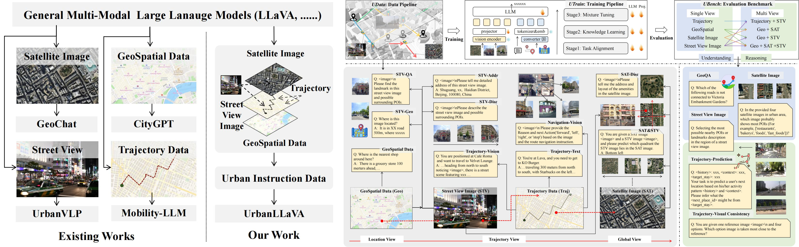

# UrbanLLaVA
This repo is for UrbanLLaVA: A Multi-modal Large Language Model for Urban Intelligence

## 📢 News
- 🎉: (2025.10) We release the first version of our code for training and evaluating UrbanLLaVA.
- 🎉: (2025.06) UrbanLLaVA has been accepted to **ICCV 2025**.

## Introduction
Urban research involves a wide range of scenarios and tasks that require the understanding of multi-modal data. Current methods often focus on specific data types and lack a unified framework in urban field for processing them comprehensively. The recent success of multi-modal large language models (MLLMs) presents a promising opportunity to overcome this limitation. In this paper, we introduce \textit{UrbanLLaVA}, a multi-modal large language model designed to process these four types of data simultaneously and achieve strong performance across diverse urban tasks compared with general MLLMs. In \textit{UrbanLLaVA}, we first curate a diverse urban instruction dataset encompassing both single-modal and cross-modal urban data, spanning from location view to global view of urban environment. Additionally, we propose a multi-stage training framework that decouples spatial reasoning enhancement from domain knowledge learning, thereby improving the compatibility and downstream performance of \textit{UrbanLLaVA} across diverse urban tasks. Finally, we also extend existing benchmark for urban research to assess the performance of MLLMs across a wide range of urban tasks. Experimental results from three cities demonstrate that \textit{UrbanLLaVA} outperforms open-source and proprietary MLLMs in both single-modal tasks and complex cross-modal tasks and shows robust generalization abilities across cities.

## 🌍 Framework

An overview of the motivation and framework of UrbanLLaVA is provided below.


## 📁 Codes Structure

**`config.py`** - Central configuration file containing:
- Model paths and API configurations for 40+ VLM models including UrbanLLaVA variants
- Dataset paths for evaluation tasks (GeoQA, mobility prediction, navigation, etc.)
- City boundary definitions for Beijing, London, and New York
- Task-to-module mappings for evaluation pipelines

**`train/`** - Training scripts and configurations
- `vila_train_scripts/` - VILA-based training scripts for UrbanLLaVA model variants

**`serving/`** - Model serving and deployment
- `vlm_serving.py` - Vision-language model serving implementation
- `llm_api.py` - Language model API interface
- `llm_serving.sh` - Serving startup scripts
- `test_llm_api.py` - API testing utilities

**`evaluate/`** - Comprehensive evaluation framework
- `cross_view/` - Cross-view tasks (SAT counting, STV comparison, location mapping)
- `general/` - General inference and statistics
- `geoqa/` - Geographic question answering evaluation
- `mobility_prediction/` - Mobility and trajectory prediction tasks
- `outdoor_navigation/` - Outdoor navigation evaluation
- `uniimage/` - Unified image processing tasks
- `vlmevalkit_vila_fix/` - VILA evaluation kit integrations

**`simulate/`** - Data simulation and preprocessing
- `address/` - Address data simulation
- `advance/` - Advanced simulation scripts
- `annotate/` - Data annotation tools
- `format/` - Data formatting utilities
- `satelite/` - Satellite image processing
- `streetview/` - Street view data processing

**`examples/`** - Usage examples and scripts
- Shell scripts for running evaluations (geoqa, mobility, navigation)
- Multi-image and uni-image inference examples
- General evaluation pipeline demonstrations


## 🔧 Training and Evaluation
### Install Git Submodules and Create Environment
```bash
cd UrbanLLaVA
git submodule init
git submodule update --init --recursive

# VILA environment for training
cd train/VILA
./environment_setup.sh

# We adjust UrbanLLaVA/evaluate/VLMEvalKit/vlmeval/vlm/vila.py to cooperate with VILA1.5 inference, please replace UrbanLLaVA/evaluate/VLMEvalKit/vlmeval/vlm/vila.py with UrbanLLaVA/evaluate/vlmevalkit_vila_fix/vila.py
cp UrbanLLaVA/evaluate/vlmevalkit_vila_fix/vila.py UrbanLLaVA/evaluate/VLMEvalKit/vlmeval/vlm/vila.py

# VLMEvalKit environment for Evaluation
cd evaluate/VLMEvalKit
pip install -e .
```

### Configure LLM API Keys

Configure the relevant API Key in .bashrc, then execute source .bashrc

```bash
export SiliconFlow_API_KEY="xx"
export DeepInfra_API_KEY="xx"
export OpenAI_API_KEY="xx"
```

### How to construct data
```bash
cd UrbanLLaVA/simulate

# Data path can be adjusted in scripts in simulate/*.bash
bash all.bash
```

### How to train a model
```bash
cd train/VILA/

# Create a new virtual environment
./environment_setup.sh

# Add new datasets, the following is an example.
# in llava/data/datasets_mixture.py
llava_instruct = Dataset(
        dataset_name="llava_instruct",
        dataset_type="torch",
        data_path="/<path-to-your-data>/llava_zh/llava_instruct_150k_zh.json",
        image_path="/<path-to-your-image>/init_ckpt/InternVL-Chat-V1-2-SFT-Data/data/coco/train2017",
        description="",
    )
add_dataset(llava_instruct)

# Adjust corresponding variables then run the train scripts
cd ..
bash sft_mix_v1.sh
```

### How to Evaluate
```bash
# First, register your model's name and path in UrbanLLaVA/config.py as instructed
# Second, fill in your model's name in UrbanLLaVA/serving/vlm_serving.py as instructed

# Now you can run the inference and count scripts

cd UrbanLLaVA

# Run geoqa task evaluation
./examples/geoqa.sh

# Run mobility prediction task evaluation
./examples/mobility.sh

# Run navigation task evaluation
./examples/navigation.sh

# Run general vision benchmarks
./run_eval_general_inference_stats.sh

# Run uni-image tasks evaluation
./run_eval_uniimage_inference_stats.sh

# Run multi-image tasks evaluation
./run_eval_multi_image_inference_stats.sh

# Finally, run interactive notebook UrbanLLaVA/results/summary.ipynb to summarize some of the results if needed.

```

## 🌟 Citation

If you find this work helpful, please cite our paper.

```latex
@inproceedings{feng2025urbanllava,
  title={UrbanLLaVA: A Multi-modal Large Language Model for Urban Intelligence with Spatial Reasoning and Understanding},
  author={Feng, Jie and Wang, Shengyuan and Liu, Tianhui and Xi, Yanxin and Li, Yong},
  booktitle={Proceedings of the IEEE/CVF international conference on computer vision},
  year={2025}
}
```

## 👏 Acknowledgement

We appreciate the following GitHub repos a lot for their valuable code and efforts.

- https://github.com/NVlabs/VILA for MLLM training
- https://github.com/hiyouga/LLaMA-Factory for LLM training
- https://github.com/tsinghua-fib-lab/CityGPT for training and benchmark
- https://github.com/tsinghua-fib-lab/CityBench for benchmark
- https://github.com/opendatalab/UrBench for benchmark
- https://github.com/tsinghua-fib-lab/AgentMove for trajectory prediction


## 📩 Contact

If you have any questions or want to use the code, feel free to contact:
Jie Feng (fengjie@tsinghua.edu.cn)
